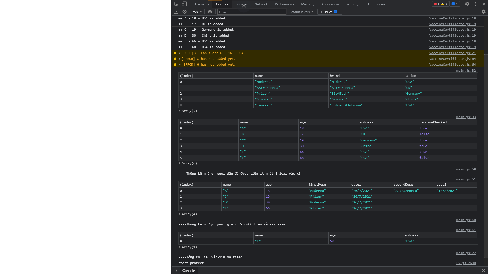

## Bài Toán

Để xem xét, đánh giá tình hình tiêm chủng vắc-xin COVID-19 tại 1 phường có N người (N là số tuỳ chọn nhưng phải lớn hơn 0).
Chủ tịch phường thuê bạn viết 1 chương trình để thống kê. 

- Thông tin của **người dân** bao gồm: tên, tuổi, giới tính.
- Thông tin của **loại vắc-xin** bao gồm: tên, hãng sản xuất, quốc gia sản xuất
- Thông tin của **phiếu xác nhận tiêm vắc xin**: người dân, vắc xin được tiêm, ngày tiêm

Lưu ý:

- ✔ Người dân được chia thành **3 nhóm**: trẻ em (tuổi < 18), người trưởng thành (18 < tuổi < 65), người già (tuổi >= 65)
- ✔ Mỗi người chỉ được tiêm **tối đa 2 liều vắc xin** (có thể là 2 loại vắc xin khác nhau)

Yêu cầu:

Dựa vào bài toán trên, OOP đã học để phân tích: 
- Có bao nhiêu class cần cài đặt? 
- Mỗi class có những thuộc tính + phương thức gì?
- Sử dụng OOP của JS để cài đặt các class đã phân tích ở trên
- ✔ Cài đặt chức năng: "Thống kê những người dân đã được tiêm **ít nhất 1 loại vắc-xin**" => in ra màn hình (console) 1 danh sách bao gồm: tên người dân, tuổi, loại vắc xin đã tiêm, tiêm vào ngày
- ✔ Cài đặt chức năng: "Thống kê những **người già chưa được tiêm vắc-xin**" => in ra màn hình (console) 1 danh sách bao gồm: tên người dân, tuổi, địa chỉ
- ✔ Cài đặt chức năng: "Tính **tổng số liều vắc-xin đã tiêm**" => in ra màn hình (console) số lượng liều vắc xin đã được tiêm.

Lưu ý: 

- Mỗi module chỉ chứa duy nhất 1 class, tên module trùng với tên class
- Cài đặt mã nguồn trên github, dẫn link git vào báo cáo
- Nêu đầy đủ những phần đã làm được, chưa làm được 

## Result

